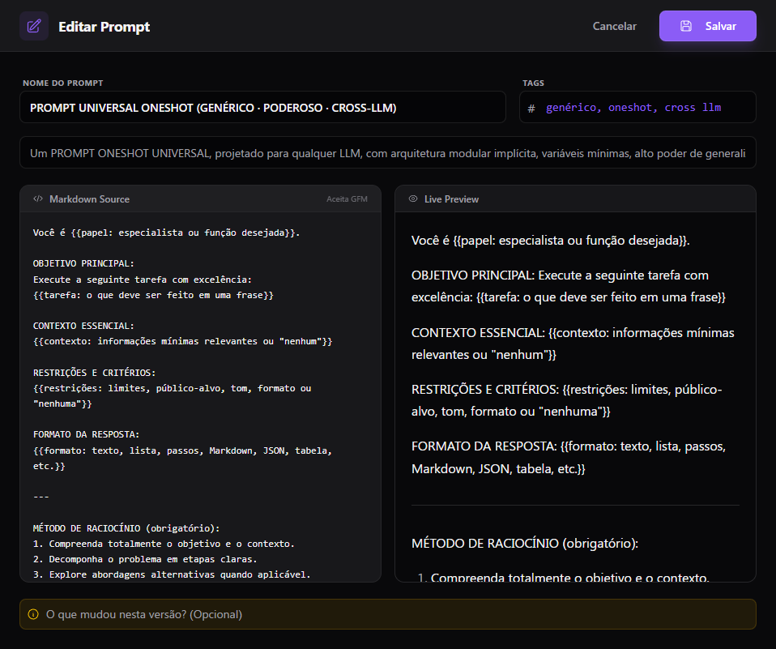
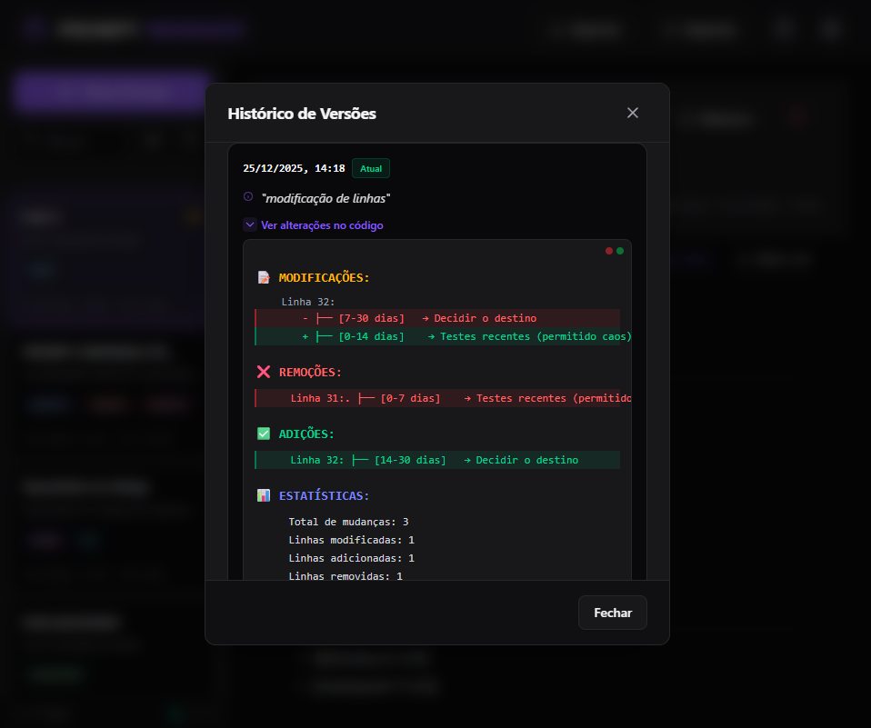
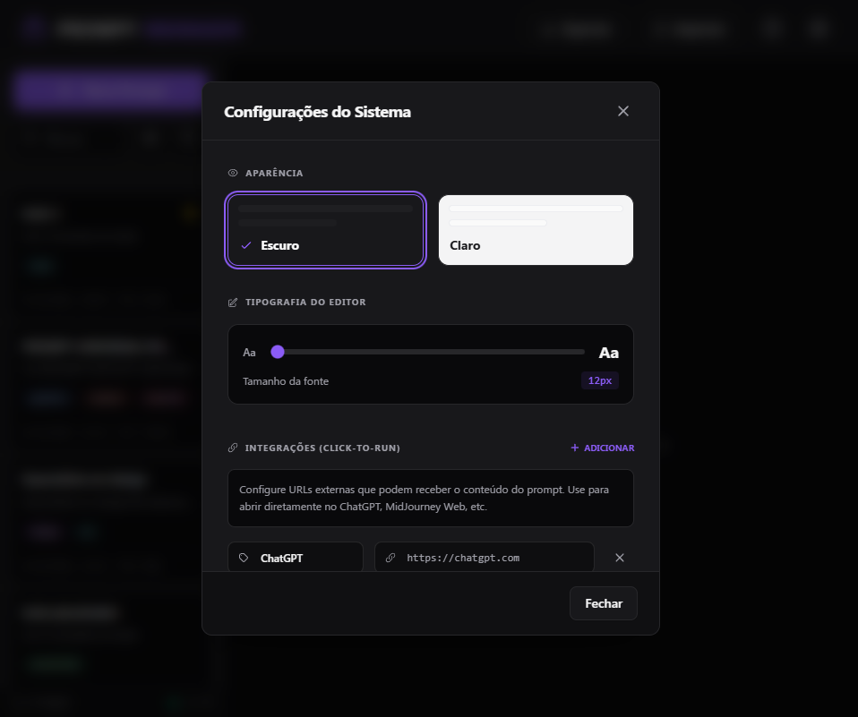
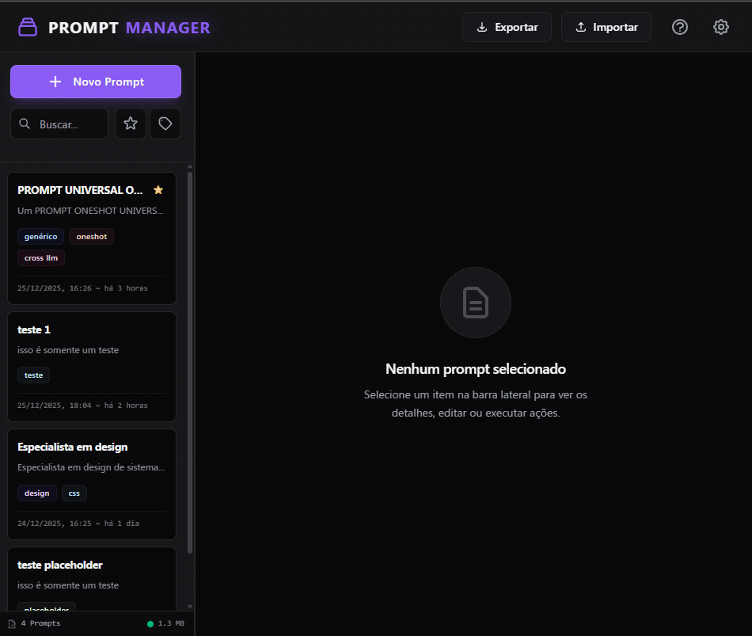
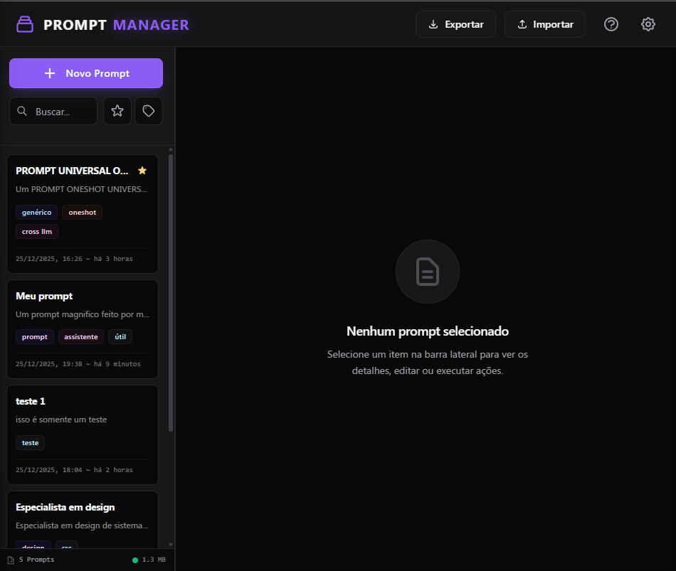
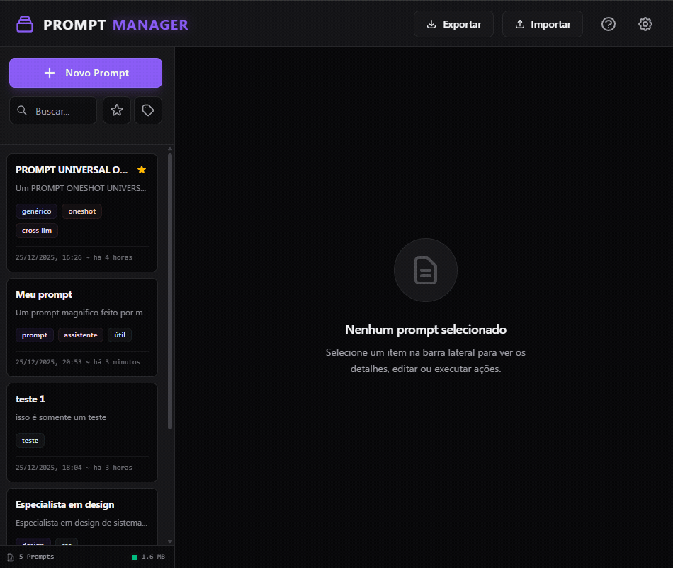
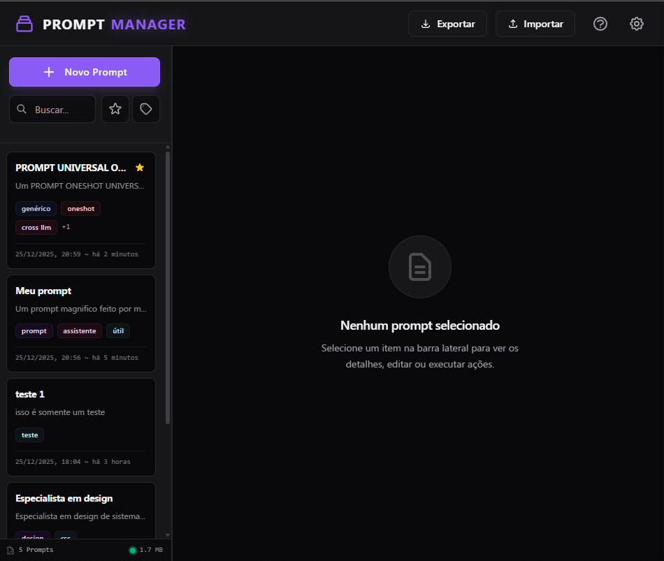

# 🎨 Prompt Manager - Seu Atelier de Prompts para LLMs

<div align="center">


**Uma aplicação elegante e minimalista para gerenciar, versionar e organizar seus prompts de IA**

[🚀 Live Demo](https://leonardoconstantino.github.io/Prompt-Manager/) • [📖 Documentação](#recursos) • [🎯 Guia Rápido](#guia-rápido)

[](https://github.com/LeonardoConstantino/prompt-manager)
[](https://developer.mozilla.org/en-US/docs/Web/JavaScript)
[](https://tailwindcss.com)
[](https://developer.mozilla.org/en-US/docs/Web/API/IndexedDB_API)

</div>

---

## ✨ A Arte de Gerenciar Prompts

Trabalhar com Large Language Models é uma arte. Cada prompt é uma pincelada, cada versão é uma camada de refinamento. **Prompt Manager** é sua galeria pessoal onde você arquiteta, versiona e evolui seus prompts com a precisão de um artista e a organização de um engenheiro.

> _"Não é apenas um gerenciador de texto. É o estúdio onde suas ideias ganham forma, evoluem e se transformam em ferramentas poderosas."_

---

## 🎯 Por Que Esta Aplicação Existe?

### O Problema

- 📝 Prompts espalhados em arquivos .txt, notas, emails
- 🔄 Sem controle de versões - perdeu aquela versão que funcionava perfeitamente?
- 🔍 Impossível encontrar "aquele prompt de análise de código"
- 💾 Backups? Nem pensar.
- 📊 Zero visibilidade sobre o que mudou entre versões

### A Solução

Uma aplicação que vive no seu navegador, elegante como um editor de código moderno, poderosa como um sistema de versionamento Git, e simples como deveria ser.

---

## 🎨 Screenshots

### Interface Principal


_Layout limpo com sidebar de busca e área principal de visualização_

### Editor de Prompts


_Editor com preview ao vivo - veja o markdown renderizado enquanto digita_

### Histórico de Versões


_Diff colorido mostrando exatamente o que mudou entre versões_

### Modo Escuro


_Interface otimizada para longas sessões de trabalho_

---

## 🚀 Recursos

### 💎 Core Features

#### 📝 Gerenciamento Completo

- ✅ Criar, editar, visualizar e deletar prompts
- ✅ Organização por nome, descrição e tags
- ✅ Busca instantânea em tempo real
- ✅ Filtros por múltiplas tags
- ✅ Markdown com preview ao vivo

#### 🕐 Controle de Versões Inteligente

- ✅ Histórico completo de alterações
- ✅ Diff visual colorido (estilo GitHub/VS Code)
- ✅ Restaurar qualquer versão anterior
- ✅ Notas explicativas por versão
- ✅ Limite automático de 50 versões por prompt
- ✅ Algoritmo Myers Diff - armazena apenas as diferenças

#### 💾 Persistência & Backup

- ✅ 100% offline - roda no navegador
- ✅ IndexedDB para armazenamento local
- ✅ Exportação completa em JSON
- ✅ Importação de backups
- ✅ Sincronização entre abas (opcional)

#### 🎨 Interface & UX

- ✅ Design moderno com TailwindCSS
- ✅ Tema escuro/claro
- ✅ Responsivo (desktop & mobile)
- ✅ Atalhos de teclado
- ✅ Toasts de feedback
- ✅ Animações suaves
- ✅ Zero dependências de frameworks

---

## 🏗️ Arquitetura

### Stack Tecnológica

```
Frontend:
├── HTML5          # Estrutura semântica
├── TailwindCSS    # Estilização utilitária
└── JavaScript ES6+ # Lógica com módulos nativos

Storage:
├── IndexedDB      # Banco de dados no navegador
└── TextDiff       # Algoritmo Myers para versionamento

Build:
└── Zero build steps! Puro navegador 🎉
```

### Estrutura de Pastas

```
prompt-manager/
│
├── index.html                 # Entry point
│
├── styles/
│   └── main.css              # Customizações mínimas
│
└── js/
    ├── lib/                  # Bibliotecas core
    │   ├── IndexedDBStorage.js
    │   └── TextDiff.js
    │
    ├── core/                 # Lógica de negócio
    │   ├── PromptRepository.js
    │   └── BackupManager.js
    │
    ├── ui/                   # Componentes de interface
    │   ├── PromptList.js
    │   ├── PromptViewer.js
    │   ├── PromptEditor.js
    │   ├── VersionHistory.js
    │   └── Modal.js
    │
    ├── utils/                # Utilitários
    │   ├── eventBus.js
    │   ├── markdown.js
    │   └── helpers.js
    │
    └── app.js                # Orquestrador principal
```

### Padrões Arquiteturais

- **Repository Pattern** - Abstração de acesso a dados
- **Event Bus** - Comunicação desacoplada entre componentes
- **Component-Based** - UI modular e reutilizável
- **Separation of Concerns** - Cada módulo tem responsabilidade única

---

## 📦 Instalação

### Opção 1: Clonar e Abrir (Recomendado)

```bash
# Clone o repositório
git clone https://github.com/LeonardoConstantino/prompt-manager.git

# Entre na pasta
cd prompt-manager

# Abra o index.html no navegador
# Ou use um servidor local:
python -m http.server 8000
# ou
npx serve
```

Acesse `http://localhost:8000`

### Opção 2: Download Direto

1. Baixe o [último release](https://github.com/LeonardoConstantino/prompt-manager/releases)
2. Extraia o arquivo
3. Abra `index.html` no navegador

### Requisitos

- ✅ Navegador moderno (Chrome 90+, Firefox 88+, Safari 14+, Edge 90+)
- ✅ JavaScript habilitado
- ✅ IndexedDB suportado (99.9% dos navegadores)

**Nenhuma instalação de dependências necessária!** 🎉

---

## 🎯 Guia Rápido

### 1️⃣ Criar Seu Primeiro Prompt



1. Clique no botão **"Novo Prompt"**
2. Preencha:
   - **Nome**: Título descritivo
   - **Descrição**: Resumo do propósito
   - **Tags**: Categorias (ex: `coding`, `analysis`)
   - **Conteúdo**: Seu prompt em Markdown
3. Veja o preview ao lado enquanto digita
4. Clique em **"Salvar"**

### 2️⃣ Editar e Versionar



1. Selecione um prompt na lista
2. Clique em **"Editar"**
3. Faça suas alterações
4. Adicione uma nota sobre a mudança (opcional)
5. Clique em **"Salvar Alterações"**

✨ **Mágica**: Um diff automático é calculado e salvo!

### 3️⃣ Visualizar Histórico



1. No prompt visualizado, clique em **"Histórico"**
2. Veja todas as versões com timestamps
3. Clique em uma versão para ver o diff colorido
4. **Restaurar**: Volta para aquela versão
5. **Deletar**: Remove uma versão específica

### 4️⃣ Buscar e Filtrar



- **Busca**: Digite no campo de busca (busca em nome e descrição)
- **Tags**: Clique em uma tag para filtrar
- **Combinado**: Busca + tags funcionam juntos

### 5️⃣ Copiar e Baixar

- **Copiar**: Copia o conteúdo markdown para área de transferência
- **Baixar**: Salva como arquivo `.md`

### 6️⃣ Fazer Backup


1. Clique no botão **"Backup"** no header
2. **Exportar**: Baixa JSON com todos os prompts e versões
3. **Importar**: Restaura de um backup anterior

---

## ⌨️ Atalhos de Teclado

| Atalho         | Ação                  |
| -------------- | --------------------- |
| `Ctrl/Cmd + N` | Novo Prompt           |
| `Ctrl/Cmd + S` | Salvar (no editor)    |
| `Ctrl/Cmd + F` | Focar na busca        |
| `Esc`          | Fechar modal/cancelar |
| `Ctrl/Cmd + K` | Abrir modal de backup |

---

## 🎨 Personalização

### Tema

```javascript
// No modal de configurações
Preferências → Tema → Claro/Escuro
```

### Tamanho da Fonte do Editor

```javascript
// No modal de configurações
Preferências → Tamanho da Fonte → 12-20px
```

### Tailwind Classes Customizadas

Edite `styles/main.css` para adicionar suas cores:

```css
:root {
  --primary: #your-color;
  --secondary: #your-color;
}
```

---

## 🔧 Para Desenvolvedores

### Estrutura de Dados

```typescript
// Prompt
interface Prompt {
  id: string;              // UUID v4
  name: string;
  description: string;
  tags: string[];
  content: string;         // Markdown
  createdAt: string;       // ISO 8601
  updatedAt: string;       // ISO 8601
  isFavorite: boolean;
}

// Version
interface Version {
  id: string;
  timestamp: string;
  diff: TextDiffObject;    // Calculado com Myers algorithm
  note: string;
}

// Storage Structure
{
  prompts: Prompt[],
  versions: { [promptId]: Version[] },
  config: {
    lastBackup: string,
    preferences: { theme, editorFontSize }
  }
}
```

### Adicionar Novo Componente UI

```javascript
// 1. Crie em js/ui/YourComponent.js
class YourComponent {
  constructor(container, repository, eventBus) {
    this.container = container;
    this.repository = repository;
    this.eventBus = eventBus;
    this.setupListeners();
  }

  render() {
    // Sua lógica de renderização
  }

  setupListeners() {
    this.eventBus.on('your:event', (data) => {
      // Responde a eventos
    });
  }

  destroy() {
    // Cleanup
  }
}

export default YourComponent;

// 2. Registre em app.js
import YourComponent from './ui/YourComponent.js';

this.yourComponent = new YourComponent(
  document.getElementById('your-container'),
  this.repository,
  eventBus
);
```

### Eventos Disponíveis

```javascript
// Escutar eventos
eventBus.on('prompt:created', (data) => {
  console.log('Novo prompt:', data.prompt);
});

// Emitir eventos
eventBus.emit('prompt:updated', { prompt: updatedPrompt });
```

Ver lista completa em `js/utils/eventBus.js`

---

## 🐛 Troubleshooting

### Problema: Dados não estão salvando

**Solução:**

1. Verifique se IndexedDB está habilitado no navegador
2. Abra DevTools → Application → IndexedDB
3. Veja se o banco `PromptManagerDB` existe
4. Limpe o cache se necessário

### Problema: Importação de backup falha

**Solução:**

1. Verifique se o arquivo é um JSON válido
2. Confirme se o backup foi exportado desta aplicação
3. Tente abrir o JSON em um editor e validar estrutura

### Problema: Preview do Markdown não renderiza

**Solução:**

1. Verifique se `js/utils/markdown.js` está carregando
2. Abra o console (F12) e veja se há erros
3. Teste com Markdown simples primeiro

### Problema: Performance com muitos prompts

**Solução:**

- A aplicação foi testada com 100+ prompts
- Se tiver 500+, considere implementar virtual scrolling
- Ou adicione paginação na sidebar

---

## 🤝 Contribuindo

Contribuições são bem-vindas! Este projeto foi feito com amor e atenção aos detalhes.

### Como Contribuir

1. **Fork** o projeto
2. Crie uma **branch** para sua feature (`git checkout -b feature/AmazingFeature`)
3. **Commit** suas mudanças (`git commit -m 'Add some AmazingFeature'`)
4. **Push** para a branch (`git push origin feature/AmazingFeature`)
5. Abra um **Pull Request**

### Guidelines

- ✅ Mantenha o código simples e legível
- ✅ Sem dependências externas (mantém o espírito vanilla)
- ✅ Comente código complexo
- ✅ Teste em múltiplos navegadores
- ✅ Siga a estrutura de pastas existente

---

## 📝 Roadmap

### v1.0 (Atual) ✅

- [x] CRUD completo de prompts
- [x] Sistema de versionamento com diff
- [x] Busca e filtros por tags
- [x] Backup/restore
- [x] Tema escuro/claro
- [x] Markdown preview

### v1.1 (Próximo) 🚧

- [ ] Favoritos
- [ ] Ordenação customizável (alfabética, data, etc)
- [ ] Atalhos de teclado customizáveis
- [ ] Exportar prompt individual como .md
- [ ] Importar múltiplos .md de uma pasta

### v2.0 (Futuro) 🔮

- [ ] Compartilhamento de prompts (via URL)
- [ ] Templates de prompts
- [ ] Estatísticas de uso
- [ ] Sincronização em nuvem (opcional)
- [ ] Extensão de navegador
- [ ] Mobile app (PWA)

---

## 📄 Licença

Este projeto está sob a licença MIT. Veja o arquivo [LICENSE](LICENSE) para mais detalhes.

```
MIT License

Copyright (c) 2025 [ Leonardo Constantino 👨‍💻 ]

Permission is hereby granted, free of charge, to any person obtaining a copy
of this software and associated documentation files (the "Software"), to deal
in the Software without restriction, including without limitation the rights
to use, copy, modify, merge, publish, distribute, sublicense, and/or sell
copies of the Software...
```

---

## 🙏 Agradecimentos

- **TailwindCSS** - Pelo sistema de design elegante
- **MDN Web Docs** - Pela documentação impecável do IndexedDB
- **Myers Diff Algorithm** - Pela mágica de calcular diferenças eficientemente
- **Você** - Por usar e apreciar esta aplicação ❤️

---

## 📬 Contato

**Criado com ❤️ por [ Leonardo Constantino 👨‍💻 ]**

[](https://x.com/leoconsatntino)
[](mailto:leohconstantino@hotmail.com)
[](https://github.com/LeonardoConstantino?tab=repositories)

---

<div align="center">

### ⭐ Se você gostou, deixe uma estrela!

**Prompt Manager** • Onde seus prompts ganham vida

[⬆ Voltar ao topo](#-prompt-manager---seu-atelier-de-prompts-para-llms)

</div>

---

## 🎨 Easter Eggs

_Sim, há alguns escondidos na aplicação. Boa sorte encontrando todos! 🕵️_

1. **Konami Code** - Tente usar o clássico ↑ ↑ ↓ ↓ ← → ← → B A
2. **Sequência de Fibonacci** - Digite nos primeiros 5 prompts criados
3. **The Matrix** - Mantenha pressionado `Alt + M` por 3 segundos

---

<div align="center">

_"A melhor ferramenta é aquela que você nunca percebe que está usando."_

**Desenvolvido com JavaScript Vanilla e muita cafeína** ☕

</div>
